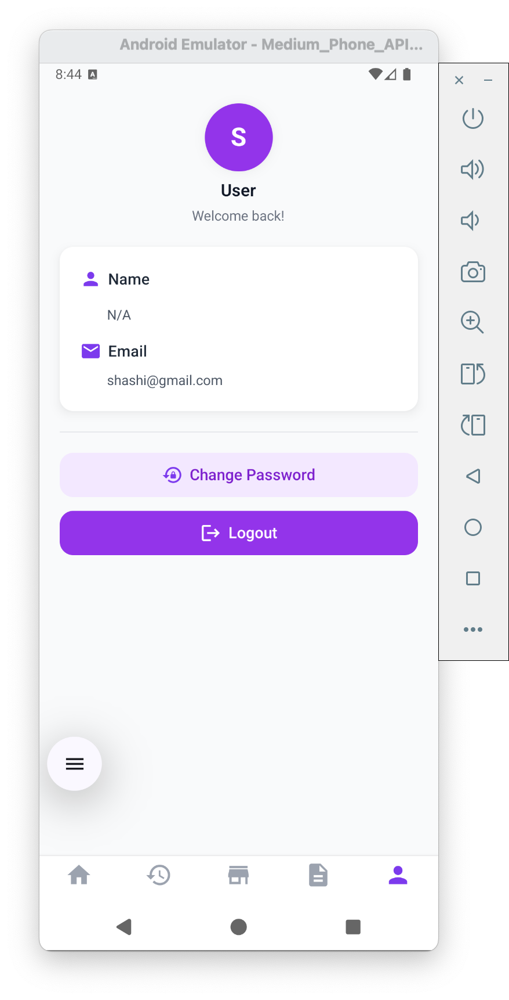
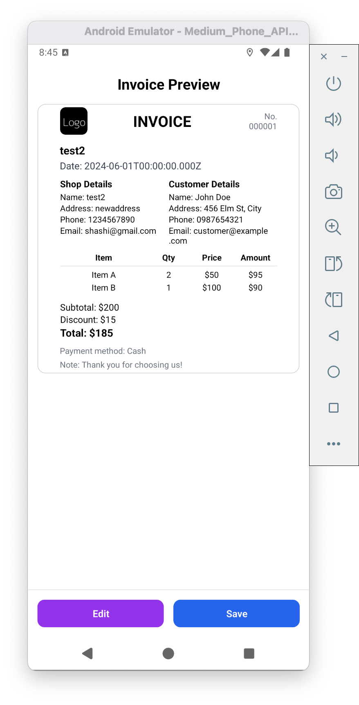

# Invoice Generator App

## Overview
Invoice Generator is a mobile application built with Expo and React Native that allows users to easily create, manage, and export invoices. The app is designed for freelancers, small businesses, and anyone who needs to generate professional invoices on the go.

## Features & Functionality
- **Create Invoices:** Add client details, items/services, quantities, prices, and taxes.
- **Edit & Delete Invoices:** Manage your invoices with full CRUD operations.
- **Export/Share:** Export invoices as PDF or image and share via email or messaging apps.
- **Invoice History:** View and manage previously created invoices.
- **Customizable Templates:** Choose or customize invoice templates for branding.

> <span style="color: #1976d2;"><b>Download the latest APK from the <a href="https://github.com/Shashi-Madushan/Invoice-Genarater-APK/releases">Releases</a> section.</b></span>

## Demo Video

[](https://youtube.com/shorts/EnfrfrshJvQ?feature=share)

Watch a short demo of the app [here](https://youtube.com/shorts/EnfrfrshJvQ?feature=share).

## Screenshots

Below are screenshots of various app screens for context:

| Register | Login | Dashboard | Invoice History |
|----------|-------|-----------|-----------------|
|  |  |  |  |

| Manage Shops | Templates Page | My Account | Template Selector |
|--------------|---------------|------------|-------------------|
|  |  |  |  |

| Invoice Form Page | Add Item to Invoice Form | Invoice Preview | Save PDF Page |
|-------------------|-------------------------|-----------------|--------------|
|  |  |  |  |

## File & Folder Structure
```
Invoice-Genarater/
├── app/                        # Main application code
│   ├── (dashboard)/            # Dashboard-related screens (home, history, stores, templates, profile)
│   │   ├── _layout.tsx         # Dashboard tab layout
│   │   ├── home.tsx            # Dashboard home screen
│   │   ├── history.tsx         # Invoice history screen
│   │   └── ...                 # Other dashboard screens
│   ├── (invoice)/              # Invoice-related screens
│   │   ├── PreviewPage.tsx     # Invoice preview screen
│   │   ├── TemplateSelector.tsx# Template selection screen
│   │   └── ...                 # Other invoice screens
│   ├── _layout.tsx             # Root layout (providers, slot)
│   └── ...                     # Other app files
├── components/                 # Reusable UI components
│   └── templates/              # Invoice templates
│       ├── Template1-minimalModern.tsx
│       ├── Template2–CleanCorporate.tsx
│       └── ...                 # Other templates
├── services/                   # Service modules (API, dashboard logic)
│   ├── dashBoardService.ts
│   └── ...                     # Other services
├── types/                      # TypeScript types (e.g., invoice types)
│   └── invoice.ts
├── utils/                      # Utility functions (PDF generation, formatting, etc.)
│   └── pdfGenerator.ts
├── assets/                     # Images, fonts, icons, splash screens
│   └── images/
├── images/                     # Screenshots and documentation images
│   ├── home.png
│   ├── create-invoice.png
│   └── ...                     # Other images
├── app-example/                # Starter/example code
├── .vscode/                    # VS Code settings
│   └── settings.json
├── global.css                  # Tailwind CSS config
├── package.json                # Project dependencies and scripts
├── app.json                    # Expo app configuration
├── tsconfig.json               # TypeScript configuration
├── babel.config.js             # Babel configuration
├── metro.config.js             # Metro bundler configuration
├── tailwind.config.js          # Tailwind CSS configuration
├── .gitignore                  # Git ignore rules
├── README.md                   # Project documentation
```

## How to Run the App
1. **Install dependencies:**
   ```bash
   npm install
   ```
2. **Start the development server:**
   ```bash
   npx expo start
   ```
3. **Open the app:**
   - Scan the QR code with Expo Go (Android/iOS)
   - Use an emulator (Android Studio/iOS Simulator)
   - Open in a development build

## How to Build APK (Android)
1. **Login to Expo:**
   ```bash
   npx expo login
   ```
2. **Build the APK:**
   ```bash
   npx expo build:android -t apk
   ```
   Or for EAS Build (recommended):
   ```bash
   npx eas build -p android --profile preview
   ```
3. **Download the APK:**
   - After build completes, download the APK from the Expo dashboard or the provided link.
   - **Or simply download the latest APK from the [Releases](https://github.com/Shashi-Madushan/Invoice-Genarater-APK/releases) section of this repository.**
   - Install the APK on your device or share with others.

## Resources
- [Expo Documentation](https://docs.expo.dev/)
- [React Native Documentation](https://reactnative.dev/)
- [EAS Build Guide](https://docs.expo.dev/build/introduction/)

## Community & Support
- [Expo GitHub](https://github.com/expo/expo)
- [Expo Discord](https://chat.expo.dev)
